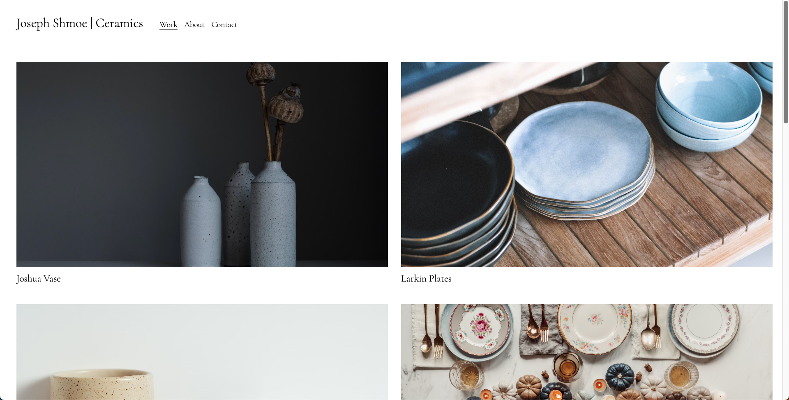
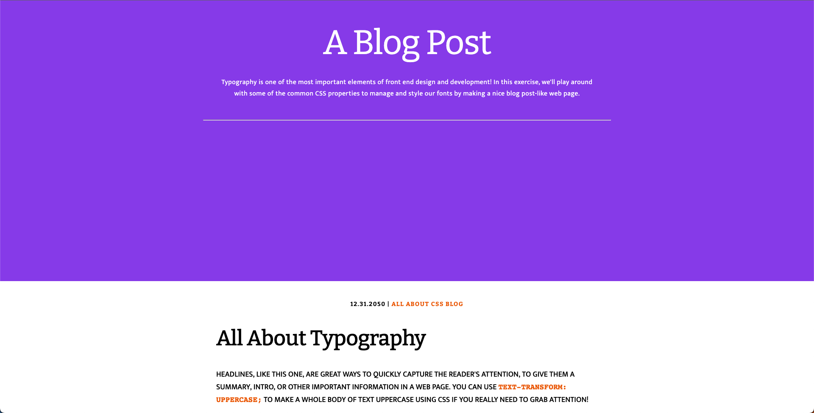
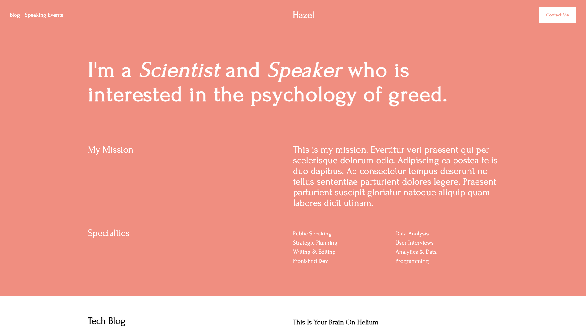

# Portfolio projects

## [JSCeramics](https://github.com/markcanning22/mwd/tree/main/artist-portfolio)

This is a project that involves building a pottery artist's website using basic CSS.

## [Blog](https://github.com/markcanning22/mwd/tree/main/blog)

This is a project that involves building a simple blog post that focuses on typography.

## [Blog](https://github.com/markcanning22/mwd/tree/main/cv)

This is a project that involves building a person's CV using new CSS units and flex box.